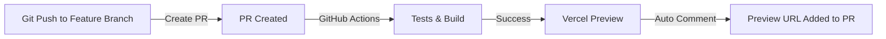
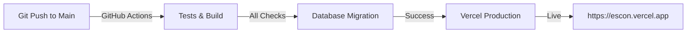

# ESCON 배포 가이드

## 개요

ESCON은 **Vercel을 통한 자동 배포**를 지원합니다. GitHub에 코드를 푸시하면 자동으로 배포됩니다.

```
Git Push
  ↓
GitHub Actions 실행
  ├─ 테스트 & 빌드 검증
  ├─ 배포 전 체크
  └─ Vercel 배포
    ├─ PR: Preview 배포 (임시 URL)
    └─ main: Production 배포 (https://escon.vercel.app)
```

---

## 준비 단계

### 1️⃣ Vercel 프로젝트 생성

```bash
# Vercel CLI 설치 (선택사항)
npm install -g vercel

# 로그인
vercel login

# 프로젝트 생성
vercel --prod
```

또는 **Vercel 대시보드에서 직접 생성**:
1. https://vercel.com/new 방문
2. GitHub 저장소 선택 (`foolpoet44/escon`)
3. Import 버튼 클릭

### 2️⃣ 환경 변수 설정

**Vercel 대시보드에서**:

1. Project Settings → Environment Variables
2. 다음 변수들을 추가:

```
NEXT_PUBLIC_SUPABASE_URL=https://xxxxx.supabase.co
NEXT_PUBLIC_SUPABASE_ANON_KEY=your-anon-key
SUPABASE_SERVICE_ROLE_KEY=your-service-role-key
LLM_PROVIDER=gemini
LLM_MODEL=gemini-2.5-flash
LLM_API_KEY=your-api-key
```

**환경별 설정 (권장)**:
- Preview (PR 배포): 테스트 데이터베이스
- Production (main 배포): 실제 데이터베이스

### 3️⃣ GitHub Actions 시크릿 설정

**GitHub 저장소에서**:

1. Settings → Secrets and variables → Actions
2. 다음 시크릿 추가:

```
VERCEL_TOKEN=your-vercel-token
VERCEL_ORG_ID=your-org-id
VERCEL_PROJECT_ID=your-project-id
SUPABASE_URL=https://xxxxx.supabase.co
SUPABASE_SERVICE_ROLE_KEY=your-service-role-key
NEXT_PUBLIC_SUPABASE_URL=https://xxxxx.supabase.co
NEXT_PUBLIC_SUPABASE_ANON_KEY=your-anon-key
LLM_PROVIDER=gemini
LLM_MODEL=gemini-2.5-flash
LLM_API_KEY=your-api-key
```

**값 얻는 방법**:

```bash
# VERCEL_TOKEN: Vercel 대시보드 → Settings → Tokens
# VERCEL_ORG_ID: Vercel 대시보드 → Team Settings → Team ID
# VERCEL_PROJECT_ID: 프로젝트 Settings에서 확인
vercel whoami  # Vercel CLI로 확인
```

---

## 배포 워크플로우

### 배포 종류

#### 1. Preview 배포 (PR)



**자동으로 발생**:
- PR 생성 시 자동 배포
- PR 업데이트 시 재배포
- 각 PR마다 고유한 URL 제공

**예**: https://escon-pr-123.vercel.app

#### 2. Production 배포 (main)



**자동 프로세스**:
1. 코드 푸시
2. 자동 테스트 & 빌드
3. 데이터베이스 마이그레이션
4. 프로덕션 배포

---

## 배포 체크리스트

### 배포 전

- [ ] 모든 테스트 통과 확인
- [ ] 로컬에서 `npm run build` 성공 확인
- [ ] 환경 변수 설정 확인
- [ ] 데이터베이스 마이그레이션 테스트

### 배포 중

- [ ] GitHub Actions 실행 모니터링
- [ ] 빌드 로그 확인
- [ ] Vercel 배포 진행 상황 확인

### 배포 후

- [ ] Preview URL 테스트 (PR의 경우)
- [ ] Production 사이트 접속 확인
- [ ] 기본 기능 테스트
- [ ] 에러 로그 확인 (Vercel Analytics)

---

## 배포 실패 처리

### 빌드 실패

**로그 확인**:
```bash
# Vercel 대시보드 → Deployments → 실패한 배포 → Build Logs
```

**일반적인 원인**:
- 환경 변수 누락
- TypeScript 타입 에러
- 의존성 문제
- 데이터베이스 연결 실패

**해결**:
```bash
# 로컬에서 재현
npm run build

# 에러 수정
git add .
git commit -m "fix: 빌드 에러 수정"
git push
# → 자동 재배포
```

### 마이그레이션 실패

**데이터베이스 연결 확인**:
```bash
# 환경 변수 확인
echo $SUPABASE_URL
echo $SUPABASE_SERVICE_ROLE_KEY

# Supabase 상태 확인
# → Supabase 대시보드 접속
```

**롤백**:
```bash
# 이전 배포로 되돌리기
# Vercel 대시보드 → Deployments → 이전 버전 → Promote to Production
```

---

## 실시간 모니터링

### Vercel Analytics

**배포 후 성능 확인**:
1. Vercel 대시보드 → Analytics
2. 확인 항목:
   - 빌드 시간
   - 응답 시간 (Core Web Vitals)
   - 에러율

### 에러 추적 (선택사항)

Sentry 통합:
```bash
# .env.production 추가
SENTRY_DSN=https://xxx@xxx.ingest.sentry.io/xxx

# 에러 자동 추적 시작
```

---

## 배포 옵션

### 수동 재배포

```bash
# 커맨드라인에서
vercel --prod

# 또는 Vercel 대시보드에서
# → Deployments → 재배포 버튼
```

### 예약 배포

```bash
# GitHub Actions 예약 실행
# .github/workflows/deploy.yml 수정
# schedule:
#   - cron: '0 2 * * *'  # 매일 오전 2시
```

### 환경별 배포

**Preview (테스트)**:
```bash
# 모든 PR에 자동 배포
```

**Staging (스테이징)**:
```bash
# develop 브랜치에 자동 배포
# (설정 추가 필요)
```

**Production (실제)**:
```bash
# main 브랜치에만 자동 배포
```

---

## 트러블슈팅

### Q: Preview URL이 생성되지 않음

**A**: GitHub Actions 로그 확인
```bash
GitHub → Actions → 워크플로우 선택 → 로그 확인
```

### Q: 환경 변수가 적용되지 않음

**A**: 재배포 필요
```
Vercel 대시보드 → Deployments → 최신 배포 → Redeploy
```

### Q: 데이터베이스 마이그레이션이 실패함

**A**: Supabase 상태 확인
```bash
# 1. Supabase 대시보드 접속
# 2. SQL Editor에서 수동 실행
# 3. 로그 확인
```

### Q: 배포는 성공했는데 페이지가 안 뜸

**A**: 다음을 확인
```bash
# 1. Vercel 빌드 로그 확인
# 2. 기본 경로 확인
# 3. next.config.js 검증
# 4. 환경 변수 확인
```

---

## 성능 최적화

### 배포 시간 단축

```bash
# 1. 캐시 활용
npm ci  # npm install 대신 사용

# 2. 불필요한 파일 제외
# .gitignore 확인

# 3. 빌드 최적화
# next.config.js 검토
```

### 런타임 성능

```bash
# 1. 이미지 최적화
# next/image 사용

# 2. 코드 분할
# 동적 import 활용

# 3. 데이터베이스 쿼리 최적화
# 인덱스 추가
```

---

## 보안

### 민감한 정보 보호

✅ **안전한 방법**:
- Vercel 환경 변수 (자동 암호화)
- GitHub Actions 시크릿
- API 키는 절대 코드에 포함 금지

❌ **위험한 방법**:
- 코드에 API 키 포함
- .env 파일을 GitHub에 커밋
- 공개 저장소에 시크릿 공개

### 배포 보안

```bash
# 1. 모든 요청은 HTTPS 사용
# Vercel이 자동 처리

# 2. 환경 변수 정기적 갱신
# 권장: 분기별 1회

# 3. 배포 로그 검토
# 시크릿 노출 확인
```

---

## 롤백 전략

### 이전 배포로 복구

```bash
# Vercel 대시보드:
# Deployments → 이전 버전 선택 → Promote to Production

# CLI:
vercel list
vercel promote <deployment-url>
```

### Git 롤백

```bash
# 이전 커밋으로 복구 (강제 X)
git revert <commit-hash>
git push  # 자동 재배포
```

---

## 배포 체크 스크립트 사용

### 로컬 배포 전 검증

```bash
npm run pre-deploy
```

**실행 내용**:
- 환경 변수 확인
- Node.js 버전 검증
- 의존성 설치
- 타입 검사
- 빌드 시뮬레이션
- 테스트 실행

---

## 참고 자료

- **Vercel 공식 문서**: https://vercel.com/docs
- **Vercel 배포 가이드**: https://vercel.com/docs/deployments/overview
- **Next.js 배포**: https://nextjs.org/docs/deployment
- **GitHub Actions**: https://docs.github.com/en/actions
